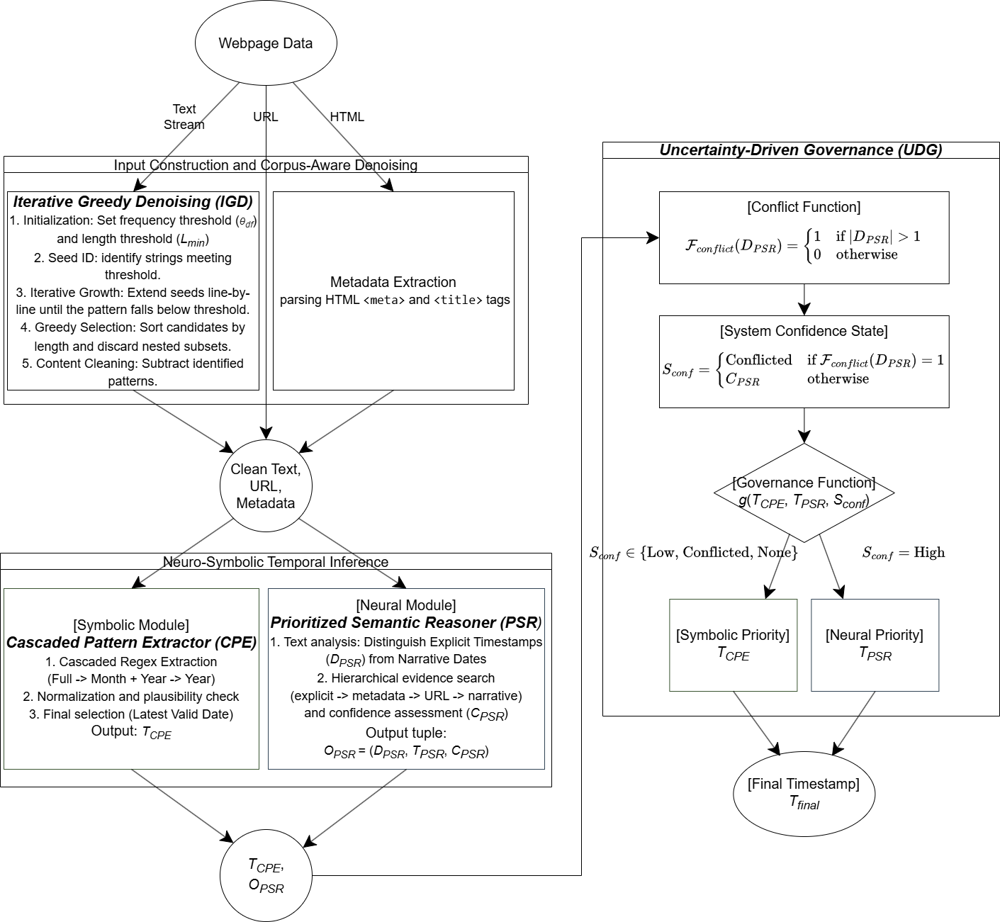
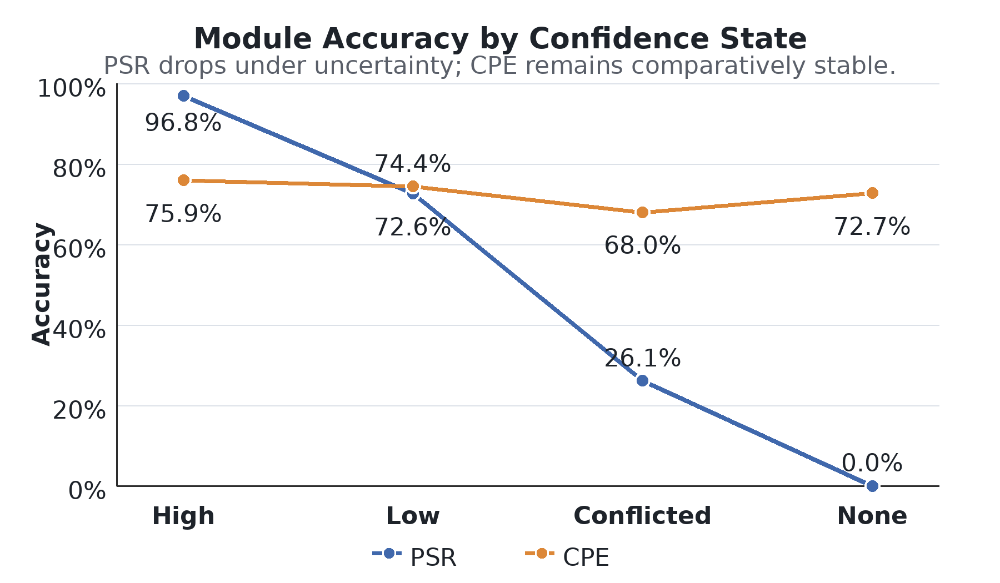

# NSTS: A Neuro-Symbolic System for Webpage Validity Timestamp Determination

[](https://opensource.org/licenses/MIT) [](https://pypi.org/project/NSTS/)

This repository contains the official source code, URL lists, labels, prediction outputs, and benchmark reports for the paper, **"NSTS: A Neuro-Symbolic System for Webpage Validity Timestamp Determination"**.

NSTS determines the **validity timestamp**: the date that best represents the current state of a webpage's primary content. Depending on the page, this may be the date of initial publication, a subsequent update or edit, or a later contribution or activity. It is distinct from **focus time**, such as the historical period discussed by a page, as well as the creation timestamp (when the page or URL was first created or indexed) and the crawl timestamp (when an external system observed the page). Dates appearing only in navigation, related links, advertisements, narrative passages, or unrelated assets are not treated as validity timestamps. Such timestamps are useful for Retrieval-Augmented Generation (RAG), temporal retrieval, web archiving, and other systems that need time-aware document evidence.

## What NSTS Does

NSTS combines a neural semantic reasoner with a deterministic symbolic extractor, then uses confidence and conflict signals to choose the safer timestamp candidate.

- **Metadata extraction** collects the page `<title>` and all `<meta>` tags from raw HTML.
- **Iterative Greedy Denoising (IGD)** removes repeated site-wide boilerplate across a corpus using exact-match text patterns.
- **Prioritized Semantic Reasoner (PSR)** uses structured LLM prompting to distinguish explicit user-facing timestamps from narrative dates.
- **Cascaded Pattern Extractor (CPE)** uses deterministic regex extraction and selects the latest valid timestamp candidate.
- **Uncertainty-Driven Governance (UDG)** trusts PSR under high-confidence semantic evidence and falls back to CPE when PSR is low-confidence, conflicted, missing, or when symbolic evidence is safer.

<p align="center">
  
</p>

## Repository Layout

```text
src/nsts/                    NSTS implementation
examples/                    Basic command-line demo
benchmarks/                  Eight-stage benchmark pipeline
benchmarks/data/url/         Source URL lists
benchmarks/data/labels/      Ground-truth labels
benchmarks/data/results/     Per-method prediction outputs
benchmarks/data/reports/     Aggregate CSV reports and figures
assets/                      README figures
```

## Installation

Install [NSTS from PyPI](https://pypi.org/project/NSTS/):

```sh
python -m pip install NSTS
```

For the full repository, including examples and benchmarks:

```sh
git clone https://github.com/ylbmq/NSTS.git
cd NSTS
python -m pip install '.[benchmarks]'
cp .env.example .env
```

`.[benchmarks]` installs NSTS from this checkout together with the dependencies for the example script, benchmark pipeline, and reports. Dependencies are defined in `pyproject.toml`. For the library alone, run `python -m pip install .`. After changing the source, repeat the installation command to install the updated code.

Create your credentials using [OpenAI API keys](https://openai.com/api/) for `OPENAI_API_KEY` and [Apify API tokens](https://apify.com/) for `APIFY_API_TOKEN`.

Set the credentials in the `.env` file copied above:

```dotenv
OPENAI_API_KEY="your-openai-key-here"
APIFY_API_TOKEN="your-apify-token-here"
```

`examples/basic_usage.py` and `benchmarks/_4_run_benchmarks.py` load `.env` using `load_dotenv()`. You can also set these variables directly in your shell or execution environment.

`OPENAI_API_KEY` is required for PSR, NSTS, and LLM-baseline runs. `APIFY_API_TOKEN` is required when text needs to be crawled. Supplying nonempty text and HTML avoids fetching, but neural modes still call OpenAI. The library itself does not automatically load `.env`; the live example and benchmark runner explicitly load it. In your own application, use environment variables or explicitly call `load_dotenv()` if you choose dotenv support.

## Determine a timestamp from a URL

Set `OPENAI_API_KEY` and `APIFY_API_TOKEN` in the environment of your Python process, then run:

```python
from nsts import NSTS

nsts = NSTS()
result = nsts.get_timestamps(url="https://www.example.com/article")
print(result)
```

With only a URL, NSTS fetches the page text through Apify, fetches HTML metadata over HTTP, and uses OpenAI for semantic reasoning. Live service calls use your accounts and may incur their normal charges.

## Use text and HTML you already have

If you already have the URL and page text, pass both to `get_timestamps`:

```python
from nsts import NSTS

url = "https://example.com/article"
text = " Published on 2020-05-17. "

nsts = NSTS()
result = nsts.get_timestamps(url=url, text=text)
print(result)
```

Supplying nonempty text avoids Apify crawling, so `APIFY_API_TOKEN` is not needed. NSTS still fetches HTML metadata from the URL, and the default mode still requires `OPENAI_API_KEY`.

If you also have the HTML, supply it to avoid fetching page content entirely:

```python
from nsts import NSTS

url = "https://example.com/article"
text = " Published on 2020-05-17. "
html = '<html><head><title>Example</title></head><body>Published on 2020-05-17.</body></html>'

nsts = NSTS()
result = nsts.get_timestamps(url=url, text=text, html=html)
print(result)
```

The default mode still calls OpenAI even when text and HTML are supplied. Omitted or empty text triggers Apify fetching; omitted or empty HTML triggers HTTP metadata fetching.

## Choose a mode and LLM model

| `extraction_method` | Behavior | Credentials |
| --- | --- | --- |
| `"nsts"` (default) | Combines symbolic and semantic candidates using confidence. | OpenAI; Apify if fetching text. |
| `"psr"` | Uses semantic reasoning. | OpenAI; Apify if fetching text. |
| `"cpe"` | Uses deterministic date patterns. | Apify only if fetching text. |

Specify the mode and model when constructing NSTS:

```python
from nsts import NSTS

nsts = NSTS(
    extraction_method="nsts",
    llm_model="gpt-4o-mini",
)
```

`gpt-4o-mini` is the default. To use another model, set `llm_model` to a model your OpenAI account supports for Chat Completions with function tools. The model setting applies to `nsts` and `psr`; `cpe` does not use an LLM.

## Read the result

Every determination example above assigns the returned dictionary to `result`. To access the selected timestamp:

```python
print(result["timestamp"])
```

The dictionary also includes the candidates and confidence:

| Field | Meaning |
| --- | --- |
| `url` | Input webpage URL. |
| `timestamp` | Selected validity timestamp, possibly a partial date or empty string. |
| `cpe_timestamp` | Symbolic candidate when CPE ran. |
| `psr_timestamp` | Semantic candidate when PSR ran. |
| `system_confidence` | PSR confidence, including `high`, `low`, `conflicted`, or `none`; may be empty if PSR did not run or failed. |

These are estimates. A date mentioned in content can differ from the page's validity date; semantic modes help distinguish those cases.

## Corpus-Level Use

IGD is a corpus-level denoising step. Use it when processing multiple pages from the same source or domain, then determine a timestamp for each cleaned item. Call `remove_boilerplate` once on the corpus; `get_timestamps` does not automatically perform corpus denoising.

The following example illustrates the workflow with two records. Replace them with your corpus. The default neural mode requires `OPENAI_API_KEY`; supplied nonempty text and HTML avoid page fetching.

```python
from nsts import NSTS

nsts = NSTS(
    min_len=30,
    min_repeatance_ratio=0.01,
    min_docs=30,
)

corpus_data = [
    {"url": "...", "text": "Header... Unique 1... Footer...", "html": "<html>...</html>"},
    {"url": "...", "text": "Header... Unique 2... Footer...", "html": "<html>...</html>"},
]

cleaned_corpus = nsts.remove_boilerplate(corpus_data)

for item in cleaned_corpus:
    result = nsts.get_timestamps(
        url=item["url"],
        text=item["text"],
        html=item["html"],
    )
    print(f"{item['url']}: {result['timestamp']}")
```

The following settings control corpus denoising:

| Parameter | Default | Meaning |
| --- | --- | --- |
| `min_len` | `30` | Minimum text-pattern length in characters considered for removal. Increase it to focus on longer repeated blocks. |
| `min_repeatance_ratio` | `0.01` | Fraction of corpus documents in which a pattern must occur, subject to the `min_docs` minimum. Increase it to require broader repetition in larger corpora. |
| `min_docs` | `30` | Minimum number of documents containing a pattern before removal. Set a smaller positive integer for a smaller corpus. |

The document threshold is `max(min_docs, int(len(corpus_data) * min_repeatance_ratio))`. With the default `min_docs=30`, a pattern must occur in at least 30 documents, so the two-item illustration above does not remove repeated patterns. With 10,000 documents and the default ratio, the threshold is 100 documents. For a smaller corpus, set `min_docs=2` to allow removal of patterns shared by at least two documents. The ratio can still require a higher document count; lowering the ratio alone does not lower `min_docs`. The above example illustrates the workflow; removal also requires a shared pattern that meets `min_len`.

Supply dictionaries with `url` and string `text` fields and, optionally, `html`. The returned list contains cleaned text with the original URL and supplied HTML; additional custom fields are not retained. Keep your original records separately if you need those fields.

## Repository examples

After installing the package and example dependencies from a checkout, run the live demo with both API credentials configured:

```sh
python examples/basic_usage.py "https://www.example.com/article"
```

## Benchmarks

The benchmark covers 33,964 webpages across 11 domains. NSTS achieves 92.49% overall accuracy and 91.77% average domain accuracy, outperforming standalone symbolic methods and a simple standalone LLM baseline.

| Domain | ADE | Htmldate | McMetadata | LLM | PSR-Only | CPE-Only | NSTS w/o IGD | NSTS |
| :--- | ---: | ---: | ---: | ---: | ---: | ---: | ---: | ---: |
| Apple | 99.01% | 0.00% | **100.00%** | 99.01% | **100.00%** | 0.00% | 98.02% | 99.01% |
| AU | 26.27% | 43.60% | 43.51% | 35.52% | 30.88% | **85.52%** | 85.15% | 83.41% |
| CAFNR | 81.67% | 20.75% | 97.82% | 62.64% | **98.60%** | 20.20% | 98.44% | 98.13% |
| COAS | 0.00% | **100.00%** | **100.00%** | 96.15% | 98.72% | 92.31% | 98.29% | 98.29% |
| Google | 67.71% | 67.71% | 67.71% | **79.86%** | 73.23% | 43.75% | 76.06% | 76.16% |
| Healthline | 31.22% | **99.55%** | 29.69% | 95.52% | 97.94% | 90.37% | 91.09% | 98.48% |
| Hollywood | 85.71% | 51.26% | 85.71% | 80.29% | **86.25%** | 47.17% | 85.45% | 85.39% |
| SO | 24.66% | 41.89% | 41.89% | 31.65% | 30.61% | **81.55%** | 62.52% | 78.74% |
| TOH | 44.85% | 65.19% | 61.45% | 91.97% | **99.73%** | 57.83% | 98.53% | 99.33% |
| Treasury | 0.00% | 84.28% | 84.28% | 92.29% | **94.99%** | 67.55% | 90.46% | 94.53% |
| VOA | 80.46% | 73.43% | 80.37% | 96.93% | 97.15% | 89.50% | 91.75% | **98.04%** |
| Overall | 57.08% | 69.40% | 72.60% | 84.39% | 86.36% | 74.72% | 87.53% | **92.49%** |
| Average | 49.23% | 58.88% | 72.04% | 78.35% | 82.55% | 61.43% | 88.71% | **91.77%** |

ADE denotes ArticleDateExtractor. Overall accuracy is webpage-weighted across the whole corpus; Average is the unweighted mean across the 11 domains.

Symbolic partner ablation shows that CPE is the strongest partner for PSR under UDG, even though other symbolic extractors can be stronger as standalone tools.

| Domain | ADE + PSR + UDG | Htmldate + PSR + UDG | McMetadata + PSR + UDG | CPE + PSR + UDG |
| :--- | ---: | ---: | ---: | ---: |
| Apple | **100.00%** | 99.01% | **100.00%** | 99.01% |
| AU | 26.35% | 41.05% | 41.05% | **83.41%** |
| CAFNR | 98.52% | 98.05% | **98.60%** | 98.13% |
| COAS | 97.01% | **98.72%** | **98.72%** | 98.29% |
| Google | 68.64% | 68.64% | 68.64% | **76.16%** |
| Healthline | 97.54% | **98.75%** | 97.40% | 98.48% |
| Hollywood | **86.21%** | 85.20% | **86.21%** | 85.39% |
| SO | 24.79% | 40.46% | 40.46% | **78.74%** |
| TOH | 98.93% | **99.46%** | **99.46%** | 99.33% |
| Treasury | 94.27% | **95.34%** | **95.34%** | 94.53% |
| VOA | 97.16% | 97.27% | 97.15% | **98.04%** |
| Overall | 85.06% | 87.00% | 86.92% | **92.49%** |
| Average | 80.86% | 83.81% | 83.91% | **91.77%** |

NSTS confidence-state distribution shows where UDG expects semantic reasoning to be reliable and where it should be cautious.

| Domain | High | Low | Conflicted | None |
| :--- | ---: | ---: | ---: | ---: |
| Apple | 99.01% | 0.00% | 0.99% | 0.00% |
| AU | 25.55% | 2.04% | 72.42% | 0.00% |
| CAFNR | 99.14% | 0.08% | 0.78% | 0.00% |
| COAS | 98.29% | 0.00% | 1.71% | 0.00% |
| Google | 67.89% | 0.45% | 31.66% | 0.00% |
| Healthline | 97.81% | 0.81% | 1.34% | 0.04% |
| Hollywood | 97.36% | 0.31% | 2.33% | 0.00% |
| SO | 27.39% | 1.60% | 70.97% | 0.04% |
| TOH | 99.06% | 0.13% | 0.40% | 0.40% |
| Treasury | 98.71% | 0.02% | 1.21% | 0.06% |
| VOA | 93.65% | 0.36% | 5.90% | 0.09% |
| Overall | 84.78% | 0.48% | 14.67% | 0.06% |
| Average | 82.17% | 0.53% | 17.25% | 0.06% |

Confidence-conditioned accuracy explains the governance behavior: PSR is strongest under high confidence, while CPE is more stable under conflicted and missing-confidence states.

<p align="center">
  
</p>

## Reproducing Reports

The repository already includes the benchmark artifacts needed to inspect the reported results. You do not need to run the pipeline just to view the current outputs.

Provided artifacts include:

```text
benchmarks/data/url/                  Source URL lists
benchmarks/data/labels/               Ground-truth labels
benchmarks/data/labels/validation/    Manual label-validation workbook and sampling manifest
benchmarks/data/results/              Per-method prediction outputs
benchmarks/data/reports/              Aggregate CSV reports and figures
```

The benchmark labels were audited using a reproducible stratified sample of
100 pages from each of the 11 domains (1,100 pages total; seed 42). One
reviewer first applied the benchmark labeling protocol without seeing the
script-generated timestamp and recorded a day-level timestamp. After this
initial decision, the generated timestamp was revealed and the manual entry
was checked for omissions or scanning mistakes, especially on long Q&A pages
with many timestamps. Automatic timestamps matched the final manual review on
1,094 pages (99.45%), with domain-level agreement ranging from 96% to 100%.
The detailed audit is available in
[`label_validation.xlsx`](benchmarks/data/labels/validation/label_validation.xlsx),
with sampling details recorded in
[`sampling_manifest.json`](benchmarks/data/labels/validation/sampling_manifest.json).

These released artifacts support verification of the published results without requiring a new crawl. The pipeline also supports re-execution when the required live inputs and credentials are available, but a fresh run is not expected to reproduce the exact numbers: webpages may change or disappear, crawler output may differ, and hosted-model behavior is probabilistic.

To inspect existing aggregate reports, open:

```text
benchmarks/data/reports/baseline_comparison.csv
benchmarks/data/reports/internal_ablation.csv
benchmarks/data/reports/symbolic_partner_ablation.csv
benchmarks/data/reports/confidence_distribution.csv
benchmarks/data/reports/confidence_accuracy.csv
benchmarks/data/reports/figures/confidence_accuracy.png
```

To perform a live rerun, use:

```sh
python benchmarks/pipeline.py
```

The pipeline is dependency-aware. It checks each stage, resumes missing work when possible, and asks before deleting stale downstream files when upstream artifacts must be regenerated. In a fresh clone, where raw text/HTML are intentionally absent, running the pipeline may prompt before deleting provided labels, results, and reports so it can rebuild them from a new crawl.

Only run the pipeline if you intend to rebuild benchmark artifacts locally. A full live rerun requires `APIFY_API_TOKEN` for crawling and `OPENAI_API_KEY` for NSTS/PSR/LLM benchmark stages.

The live pipeline runs eight stages:

1. Download missing text content.
2. Download missing HTML content.
3. Generate missing labels.
4. Run missing benchmarks.
5. Save evaluation reports.
6. Save symbolic partner ablation report.
7. Save confidence analysis reports.
8. Generate report figures.

## Dataset and Availability

The benchmark includes 33,964 webpages from 11 sources:

| Source | Pages |
| :--- | ---: |
| Apple | 101 |
| AskUbuntu | 1,374 |
| CAFNR | 1,282 |
| COAS | 234 |
| Google | 3,989 |
| Healthline | 2,233 |
| Hollywood Reporter | 1,588 |
| Stack Overflow | 2,380 |
| Taste of Home | 747 |
| U.S. Treasury | 4,956 |
| VOA | 15,080 |

To respect copyright restrictions, this repository does not redistribute scraped webpage text or source HTML. Instead, it provides the URL lists, labels, label-validation workbook and sampling manifest, prediction outputs, aggregate reports and figures, and the scripts, prompts, model settings, and configuration needed to audit the published results or rerun the pipeline.

## Citation

If you use NSTS or the benchmark artifacts in research, please cite the paper:

```bibtex
@inproceedings{lin2026nsts,
  author = {Lin, Ying-Chen and Liu, Zhiguang and Shang, Yi},
  title = {{NSTS}: A Neuro-Symbolic System for Webpage Validity Timestamp Determination},
  booktitle = {Proceedings of the 2026 ACM/IEEE Joint Conference on Digital Libraries (JCDL '26)},
  year = {2026},
  month = oct,
  address = {Frisco, TX, USA},
  publisher = {Association for Computing Machinery},
  isbn = {979-8-4007-2597-5},
  doi = {10.1145/3805696.3846014},
  note = {October 13--16, 2026},
  url = {https://doi.org/10.1145/3805696.3846014}
}
```
